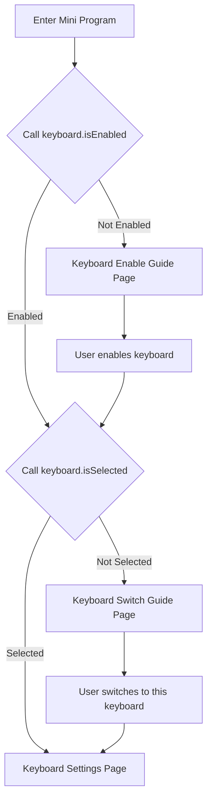

import useBaseUrl from '@docusaurus/useBaseUrl'

# Quick Start

## Introduction

Some relevant background information:

:::info

- **Device Requirements**: Custom Keyboard functionality requires devices with API_LEVEL 4.2 and above
- **Technical Architecture**: Input functionality is implemented through "Keyboard Widget", which must be attached to a Mini Program host (see [Overall Architecture](#overall-architecture))
- **API Limitations**: "Keyboard Widget" has access to most JS API capabilities, but with some limitations (see [API Limitations](#api-limitations))

:::

## Overall Architecture

**Relationship**: The "Keyboard Widget" is attached to a "Mini Program Host", and together they form a complete custom keyboard functionality.

The "Keyboard Widget" is the interface that actually performs input operations, as shown in the image below:


The "Keyboard Widget" is attached to a "Mini Program Host" and needs to be registered in the `app.json` of the "Mini Program Host". See [`app.json` Configuration](#appjson-configuration) for details.

The "Mini Program Host" can be accessed from the application list and typically includes the following features:

- Responsible for user guidance for custom keyboard functionality system settings
- Provides "Keyboard Widget" settings
- Provides an entry point to launch the "Keyboard Widget", allowing users to experience input effects within the app

The "Keyboard Widget" occupies the entire screen space. Custom keyboards need to be enabled in System Settings -> Preferences -> Keyboard. By clicking the globe icon in the system keyboard, you can switch the current keyboard to the "Keyboard Widget" for input.

The "Keyboard Widget" typically includes the following features:

- Input text field
- Keyboard Area
- Through a combination of [keyboard APIs](../../reference/device-app-api/newAPI/ui/keyboard.mdx), intelligent features such as text prediction and smart completion can be implemented

## Key Points

### Related APIs

- [DataWidget Constructor](../../reference/device-app-api/newAPI/global/DataWidget.mdx)
  - "Keyboard Widget" needs to be created using the `DataWidget` constructor
- [SYSTEM_KEYBOARD API](../../reference/device-app-api/newAPI/ui/widget/SYSTEM_KEYBOARD.mdx)
  - Through the `SYSTEM_KEYBOARD` API, you can invoke the system keyboard in scenarios requiring input. By specifying `inputType`, you can directly launch an enabled "Keyboard Widget"
- [keyboard API](../../reference/device-app-api/newAPI/ui/keyboard.mdx)
  - Through a combination of keyboard APIs, you can control input fields and cursors, and implement features like text prediction and smart completion

### app.json Configuration

For `app.json`, please refer to [Mini Program Configuration](../../reference/app-json.mdx).

:::info
Custom Keyboard functionality can only be used on devices with API_LEVEL `4.2` and above. The `minVersion` needs to be configured as `4.2`.
:::

The "Keyboard Widget" needs to be configured in the `module` field, where `data-widget` represents system functionality extension configuration.

The `widgets` field is an array with a current maximum length of `1`, meaning that within the same appId "Mini Program Host", at most `1` "Keyboard Widget" can exist simultaneously (multiple widgets may be supported in the future).

```json
"module": {
  "data-widget":{
    "widgets": [{
      "name": "English",
      "path": "data-widget/index",
      "icon": "icon.png",
      "runtime": {
        "ability": [{
          "name": "en-US", // English
          "type": 2,
          "subType": []
        }]
      }
    }]
  },
}
```

| Property | Type     | Description                                                                                      |
| -------- | -------- | ------------------------------------------------------------------------------------------------ |
| name     | `string` | Fill in the supported language, such as `"en-US"`. For all supported languages, see [Multi-language Mapping](../../reference/related-resources/language-list.mdx) |
| type     | `number` | Fill in `2` for custom keyboards                                                                 |

The `appName` field in `app.json` represents the name of the "Keyboard Widget", displayed in System Settings -> Preferences -> Keyboard. The name displayed for the "Mini Program Host" in the application list is also `appName`.

### Lifecycle

The lifecycle of "Keyboard Widget" is basically consistent with the [Zepp OS Mini Program Lifecycle](../../guides/framework/device/life-cycle.md), with the addition of `onResume` and `onPause` lifecycle methods.

Before introducing the lifecycle, let's first introduce a concept called the "Pause" state. In this state, the application's context information is retained, but it cannot respond to registered callback functions, and registered timers are paused.

After the system keyboard is invoked, regardless of whether the "Keyboard Widget" is the currently selected keyboard, the `onInit` and `build` lifecycle methods of the "Keyboard Widget" will be executed, followed by triggering `onPause` (immediately `onPause` after creation is complete). When the "Keyboard Widget" is selected, `onResume` is triggered. When the user switches from the "Keyboard Widget" to another keyboard, the `onPause` lifecycle is triggered.

### Mini Program Main Body Design Guidelines

The Mini Program main body must include keyboard enable guidance, and developers are encouraged to provide keyboard experience, settings, and personalization features in the Mini Program main body.

The enable guidance needs to include two steps:

1. **Keyboard Enable**
   - Corresponding APIs: `keyboard.isEnabled`, `keyboard.gotoSettings`
2. **Keyboard Switch**
   - Corresponding API: `keyboard.isSelected`

**Complete Flow Description:**

1. After entering the Mini Program main body, call `keyboard.isEnabled` to determine if the keyboard is enabled
   - If not enabled → Enter keyboard enable guide page
   - If enabled → Proceed to keyboard switch guidance

2. In the keyboard switch guidance phase, call `keyboard.isSelected` to determine if the current keyboard is selected
   - If not selected → Enter keyboard switch guide page
   - If selected → Directly enter keyboard settings page

**Flow Chart:**



:::info
This flow is easier to understand when combined with the examples at the end of the document running on real devices. You can directly reuse the code and image resources from the sample applications, and developers are also encouraged to implement this part of the UI themselves.
:::

:::warning
The firmware of Amazfit Active 2 (Round), Amazfit Active 2 (Square), and Amazfit Bip 6 temporarily lacks these three APIs, which are expected to be fixed in the OTA at the end of 2025. If you publish your work before then, you need to check for API existence. If the APIs don't exist, it's recommended to show the keyboard enable guide and keyboard switch guide interface every time you enter the Mini Program main body.
:::

### API Limitations

- The "Keyboard Widget" has drawing area boundary limitations. The drawing area boundaries are consistent with the current device's screen boundaries. For example, with Amazfit Balance 2, the screen resolution is 480x480, and the drawing area cannot exceed this range.
- Any UI controls related to scrolling, sliding, and layer stacking cannot be used, such as `SCROLL_LIST`, `VIEW_CONTAINER`
- For user privacy protection, the "Keyboard Widget" cannot communicate with companion services and cannot use BLE-related APIs

## Complete Examples

- [Github Sample - English T9 Keyboard](https://github.com/zepp-health/zeppos-samples/tree/main/application/4.2/t9-keyboard)
- [Github Sample - Chinese Pinyin Keyboard](https://github.com/zepp-health/zeppos-samples/tree/main/application/4.2/simple-keyboard)
