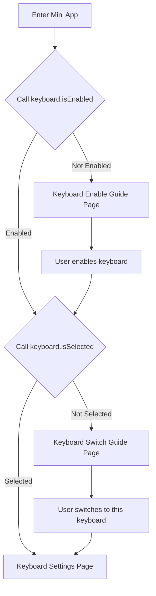

import useBaseUrl from '@docusaurus/useBaseUrl'

# 快速上手

## 介绍

一些相关背景：

:::info

- **设备要求**：「自定义键盘」功能需要 API_LEVEL 4.2 及以上的设备支持
- **技术架构**：输入功能通过「键盘 Widget」实现，「键盘 Widget」必须依附于小程序主体（详见[整体架构](#整体架构)）
- **API 限制**：「键盘 Widget」拥有大多数 JS API 能力，但存在部分限制（详见[API 限制](#api-限制)）

:::

## 整体架构

**关系说明**：「键盘 Widget」 依附于「小程序主体」，两者共同构成完整的自定义键盘功能。

「键盘 Widget」是实际执行输入操作的界面，如下图所示：


「键盘 Widget」依附于一个「小程序主体」，需要在「小程序主体」的 `app.json` 中进行注册，详见 [`app.json` 配置](#appjson-配置)。

「小程序主体」，在应用列表可以进行访问，通常包含以下功能：

- 负责自定义键盘功能系统设置的用户引导
- 提供「键盘 Widget」设置
- 提供拉起「键盘 Widget」的入口，可以在应用内体验输入效果

「键盘 Widget」占据一整个屏幕空间，自定义键盘需要在系统设置 -> 偏好设置 -> 键盘中设置启用，通过点击系统键盘中的地球图标，就可以将当前键盘切换到「键盘 Widget」进行输入。

「键盘 Widget」通常包含以下功能：

- Input 输入框
- Keyboard Area 键盘区域
- 通过一系列 [keyboard API](../../reference/device-app-api/newAPI/ui/keyboard.mdx) 的组合，可以实现文本预测，智能补全等智能化的功能

## 相关要点

### 相关 API

- [DataWidget 构造函数](../../reference/device-app-api/newAPI/global/DataWidget.mdx)
  - 「键盘 Widget」需要使用 `DataWidget` 构造函数进行创建
- [SYSTEM_KEYBOARD API](../../reference/device-app-api/newAPI/ui/widget/SYSTEM_KEYBOARD.mdx)
  - 通过 `SYSTEM_KEYBOARD` API 可以在需要输入的场景下，调用系统键盘，通过指定 `inputType`，可以直接拉起已经启用的「键盘 Widget」
- [keyboard API](../../reference/device-app-api/newAPI/ui/keyboard.mdx)
  - 通过一系列 keyboard API 的组合可以对输入框、光标进行控制，也可以实现文本预测、智能补全等功能

### app.json 配置

`app.json` 请参考 [小程序配置](../../reference/app-json.mdx)。

:::info
「自定义键盘」功能必须在 API_LEVEL `4.2` 及以上的设备才可以使用，`minVersion` 需要配置为 `4.2`。
:::

「键盘 Widget」需要在 `module` 字段中进行配置，`data-widget` 代表系统功能扩展配置。

`widgets` 字段为一个数组，目前最大长度为 `1`，即同一个 appId 的「小程序主体」中，最多可以同时存在 `1` 个「键盘 Widget」（后期可能会支持多个）。

```json
"module": {
  "data-widget":{
    "widgets": [{
      "name": "English",
      "path": "data-widget/index",
      "icon": "icon.png",
      "runtime": {
        "ability": [{
          "name": "en-US", // 中文
          "type": 2,
          "subType": []
        }]
      }
    }]
  },
}
```

| 属性    | 类型            | 说明                                                                                      |
| ------- | --------------- | ----------------------------------------------------------------------------------------- |
| name | `string` | 填写支持的语言，如 `"en-US"`，支持的所有语言请参考 [多语言映射](../../reference/related-resources/language-list.mdx) |
| type    | `number`        | 自定义键盘填写 `2`                                                  |

`app.json` 中的 `appName` 字段代表了「键盘 Widget」的名称，在系统设置 -> 偏好设置 -> 键盘中展示，「小程序主体」在应用列表中展示的名称也是 `appName`。

### 生命周期

「键盘 Widget」的生命周期与 [Zepp OS 小程序生命周期](../../guides/framework/device/life-cycle.md) 基本一致，新增了 `onResume` 和 `onPause` 生命周期。

在介绍生命周期之前，先引入一个概念，叫做「Pause」状态，在这个状态下应用的上下文信息会保留，但是无法响应注册的回调函数，注册的定时器会暂停。

在系统键盘被调起之后，不论「键盘 Widget」是否为当前选中的键盘，都会执行「键盘 Widget」的 `onInit` 和 `build` 生命周期，之后触发 `onPause`（创建完成后立即 `onPause`），当被「键盘 Widget」被选中之后，触发 `onResume`，当用户从「键盘 Widget」切换到其他键盘时，会触发 `onPause` 生命周期。

### 小程序主体的设计规范

小程序主体必须包含键盘的启用引导，鼓励开发者在小程序主体中提供键盘体验、设置功能以及个性化功能。

启用引导需要包含两个步骤：

1. **键盘启用**
   - 对应 API：`keyboard.isEnabled`、`keyboard.gotoSettings`
2. **键盘切换**
   - 对应 API：`keyboard.isSelected`

**完整流程说明：**

1. 进入小程序主体后，调用 `keyboard.isEnabled` 判断键盘是否启用
   - 如果未启用 → 进入键盘启用引导页面
   - 如果已启用 → 进入键盘切换引导判断

2. 在键盘切换引导阶段，调用 `keyboard.isSelected` 判断当前键盘是否为选中状态
   - 如果不是选中状态 → 进入键盘切换引导页面
   - 如果是选中状态 → 直接进入键盘设置页面

**流程图：**



:::info
此流程结合文末示例在真机的运行效果更容易理解，可以直接将示例应用中的代码和图片资源复用，也鼓励开发者自行实现这部分的 UI
:::

:::warning
Amazfit Active 2 (Round), Amazfit Active 2 (Suqare), Amazfit Bip 6 的真机固件暂时缺失这部分的三个 API，预计在 2025 年底的 OTA 可以修复，如果在这之前上架作品，需要做一下 API 的存在性判断，如果不存在 API，建议每次进入小程序主体程序，都展示键盘的启用引导和键盘切换引导界面
:::

### API 限制

- 「键盘 Widget」的绘图区域有边界限制，绘图区域的边界与当前设备的屏幕边界保持一致，以 Amazfit Balance 2 为例，屏幕分辨率 480x480，绘图区域不能超出这个范围
- 凡是涉及到滚动、滑动以及图层堆叠相关的 UI 控件，都无法使用，如 `SCROLL_LIST`、`VIEW_CONTAINER`
- 出于用户隐私保护考虑「键盘 Widget」无法与伴生服务进行通信，无法使用 BLE 相关的 API

### 设计建议

由于设备屏幕尺寸的限制，键盘通常以全屏模式呈现。上方为内容区域，用于实时预览已输入和正在输入的文本；下方为键盘区域，主要用于字符输入和功能键操作。


**Input 输入框区域**

- 内容操作：获取文本内容（包含全部文本、光标前后文本）、插入或删除文本字符，以及监听用户主动删除文本的事件等。
- 光标控制：支持光标向前/向后移动指定距离或移动至文本最前/末尾，以及监听用户主动移动光标的事件等。
- 待组合字符标记：对于中日韩等需要多阶段字符组合输入的语言，在展示区域使用特殊样式标记出待组合的字符（如中文拼音），供用户查看和编辑。在确认字符后，需要清除该标记，并将确认的文本保留在内容区域。当有待组合标记存在时，需限制用户仅可在标记范围内移动光标；此时点击确认键仅用于确认字符，需定义确认后的字符，未定义则直接使用待组合字符；若发生键盘切换等导致退出当前输入状态，则需移除标记并舍弃该部分待组合字符。

**Keyboard Area 键盘区域**

键盘区域是自定义键盘的核心区域，可在此实现各种字符输入与功能键操作。但需确保符合以下关键要求：

- 键盘切换键：通常以小地球图标展示，用于在多种输入法或键盘之间快速切换，或用于调出键盘菜单。
- 确认键：通常以对号、回车、发送等图标表示，用户点击后可确认已输入的文本并继续后续操作（如退出当前输入、发送消息等）。
- 键盘高度：可自定义键盘区域高度，但需确保至少能显示一行文本内容，避免输入与内容区域相互遮挡。
- 多设备适配：键盘需适配多种形状（圆形、方形）和不同尺寸的屏幕，确保在各种设备上都有一致且可用的输入体验。

## 完整示例

- [Github Sample - 英文 T9 键盘](https://github.com/zepp-health/zeppos-samples/tree/main/application/4.2/t9-keyboard)
- [Github Sample - 中文拼音键盘](https://github.com/zepp-health/zeppos-samples/tree/main/application/4.2/simple-keyboard)
